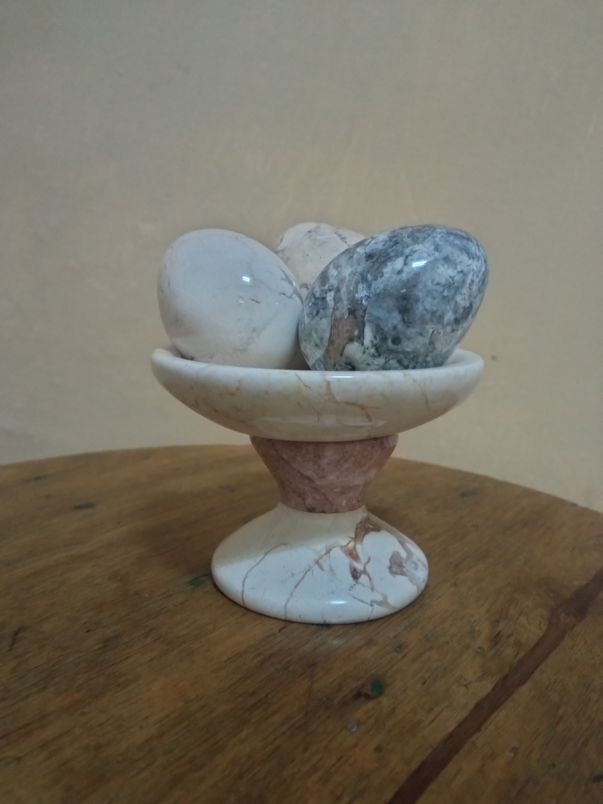
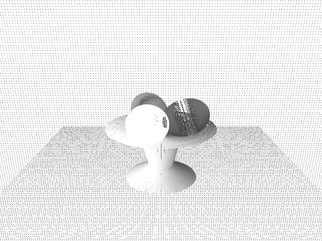
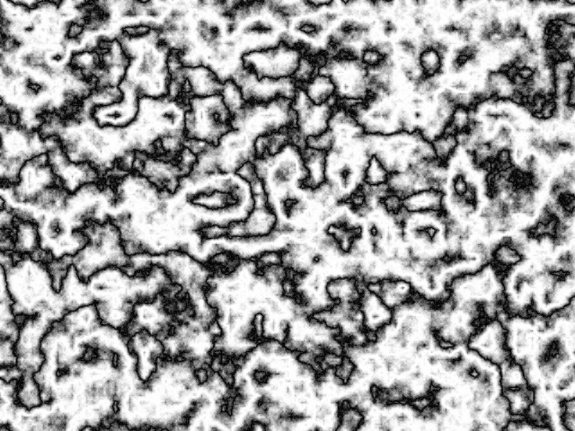
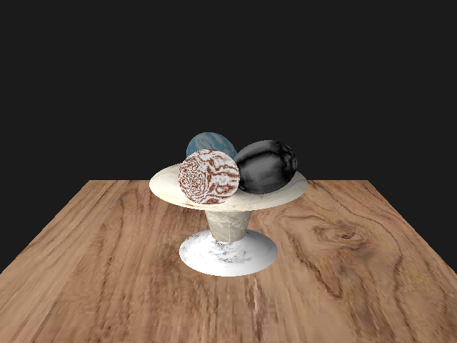

# Trabajo final de Gráficos por computadora

## Integrantes:
- Claudia Olavarrieta Martínez C511
- Marcos Adrián Valdivié Rodríguez C512

## Foto original

## Solución implementada

El objetivo del trabajo es lograr una escena lo más similar posible a la presentada anteriormente. 

La solución implementada consta de los módulos:

- ***__utils.py:__*** Este módulo contiene funciones necesarias para presentar, transformar, colocar texturas y guardar
en formato .png la escena modelada.
- ***__figures_modelation.py:__*** Se modelaron los objetos de la escena utilizando distintas instancias de la clase Mesh
del módulo ***_modeling***. Para esto se implementaron kernels que se encargaran de transformar cada mesh a la forma 
deseada. Cada región del objeto de la escena fue modelada con un mesh distinto, para que así luego fuese más fácil
añadirle sus respectivas texturas. Las fuciones para transformar los meshes en sus respectivas formas se encuentran
en el módulo ***figures_modelation.py***.

 Meshes de la escena generada

- ***__perlin_noise_textures.py:__*** Se implementó el algoritmo de Perlin Noise para añadir texturas de mármol y madera
a los objetos de la escena, aunque finalmente se decidió solo mostrar las texturas de mármol en los tres huevos, ya que
que en las secciones de la fuente o en la mesa no se veía lo suficientemente realista.

 Textura de mármol generada con Perlin Noise

- ***__play.py:__*** Este módulo contiene la lógica necesaria para hacer encajar todas las piezas en la escena. 
Se cargan las texturas para la mesa y la fuente, se generan las texturas para los huevos,
se crean y modelan los objetos, colocándolos en sus respectivas posiciones haciendo transformaciones lineales a
los mismos, y por último se renderiza la imagen.

El sombreado de la imagen se hizo utilizando el valor de la normal de cada punto, quedaría como trabajo futuro incluir 
el uso de raytracing para mejorar la iluminación y la reflexión de la luz sobre los objetos de mármol.

