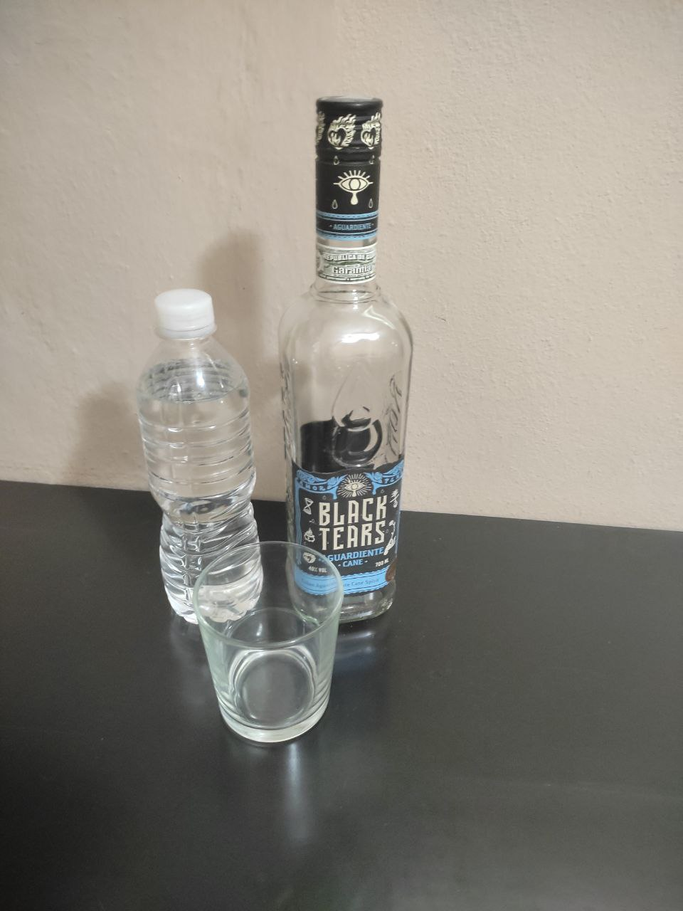
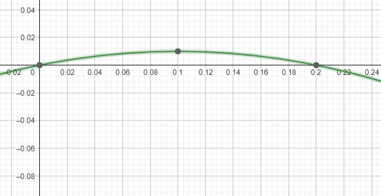
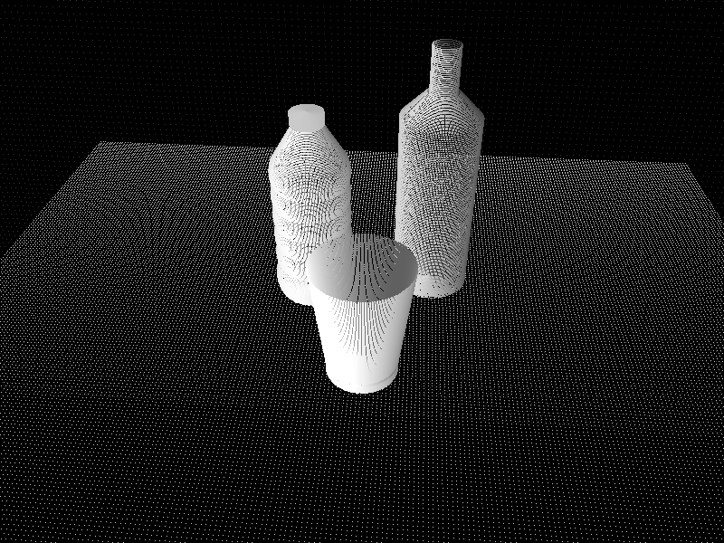
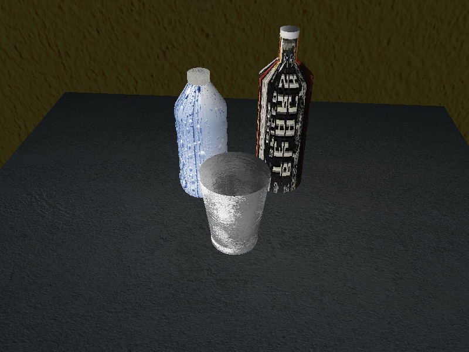

# Gráficos por computadora

## Integrantes:
- Camilo Rodriguez Velazquez C412
- Javier Villar C412
- Karel Díaz Vergara C412

## Info

Modelación y renderización de una escena compuesta por un vaso, una botella de alcohol y una botella de agua, haciendo transformaciones paramétricas en conjunto de vértices apoyándose en funciones lineales y cuadráticas para la realizacion de las mismas.

 Escena real.

Para ser mas específicos en el pomo de agua creamos la base utilizando una recta paralela al eje x, y para hacer los bordes curveos utilizamos la función cuadrática $y = -b * (x * (x - a))$, donde $a$ es el ancho de la curva, mientras más prolongada mayor $y$ puede llegar a alcanzar, por lo que multiplicamos por un factor *b* para disminur el máximo de la función, y además multiplicamos por -1 para que sea una parábola invertida.
 Función cuadrática utilizada.

Entonces haciendo uso repetidas veces de esta función podemos generar las curvas de los extremos de la botella de agua.

Para el resto de los objetos(vaso y botella de alcohol) utilizamos la combinación de funciones lineales para definir los extremos.

Vale recalcar que la tapa de la botella de agua y el fondo del vaso se realizaron aparte para poder asociarles texturas diferentes.

Resultados:

 Meshes
 Texture

Por hacer:  
- Mejorar el entendimiento del texture mapping para que la escena tenga un mejor acabado